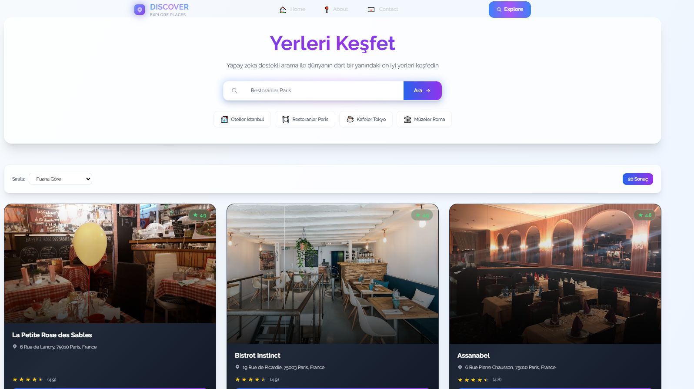
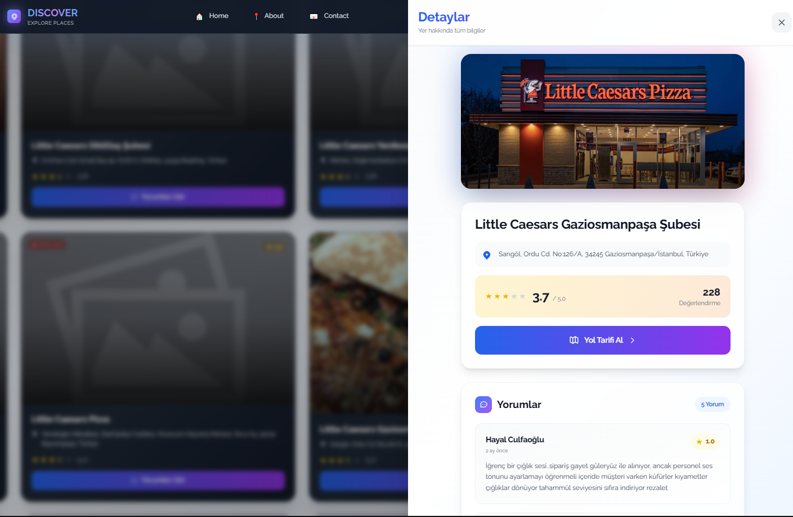
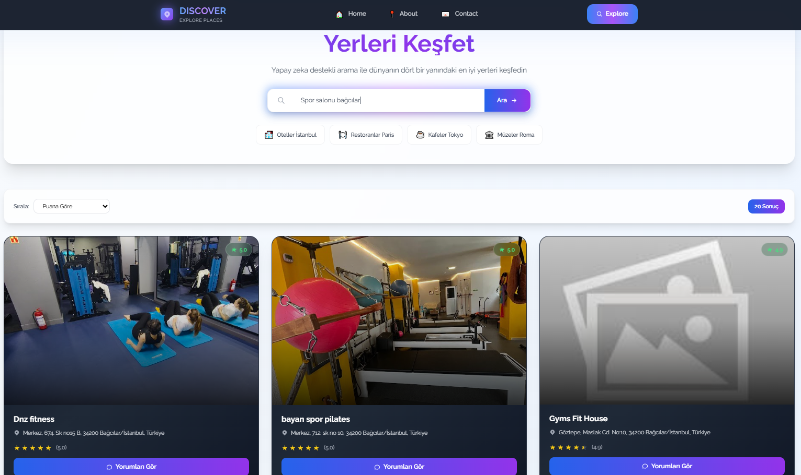

# Discover

Discover, çevrenizdeki mekanları keşfetmenize olanak tanır. Google API'si kullanarak mekanların fotoğraflarını ve kullanıcı yorumlarını görüntülemenizi sağlar. Proje, Next.js ile geliştirilmiştir.

---

## Özellikler

- Google API ile mekan arama  
- Mekan fotoğrafları ve yorumlarını görüntüleme  
- Yol tarifi alma  
- Mobil uyumlu ve hızlı tasarım  

---

## Kullanılan Teknolojiler

- Next.js  
- React  
- Tailwind CSS  
- Google Places API  

---

## Ekran Görüntüleri

  
  

**Not**: Proje kök dizininde bir `.env.local` dosyası oluşturun ve Google API anahtarlarınızı buraya ekleyin:

 GOOGLE_PLACE_KEY=senin_google_place_key
 NEXT_PUBLIC_GOOGLE_API_KEY=senin_google_api_key